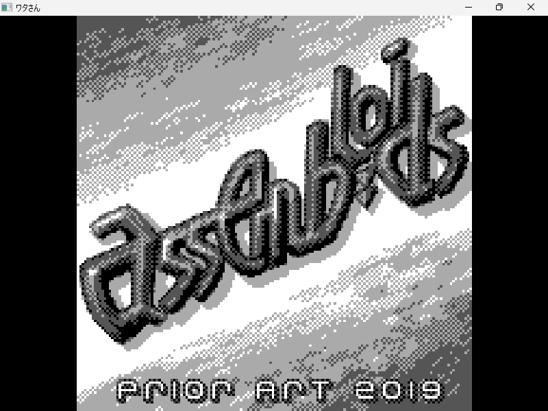
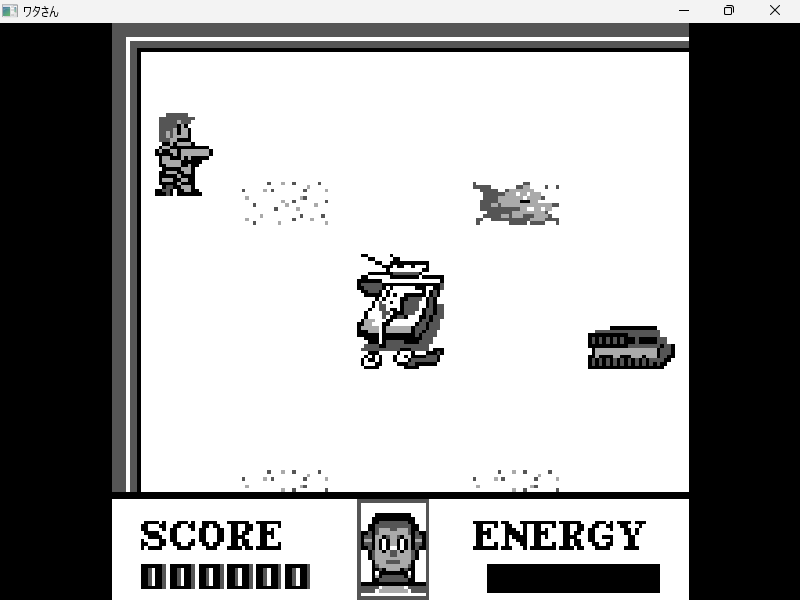
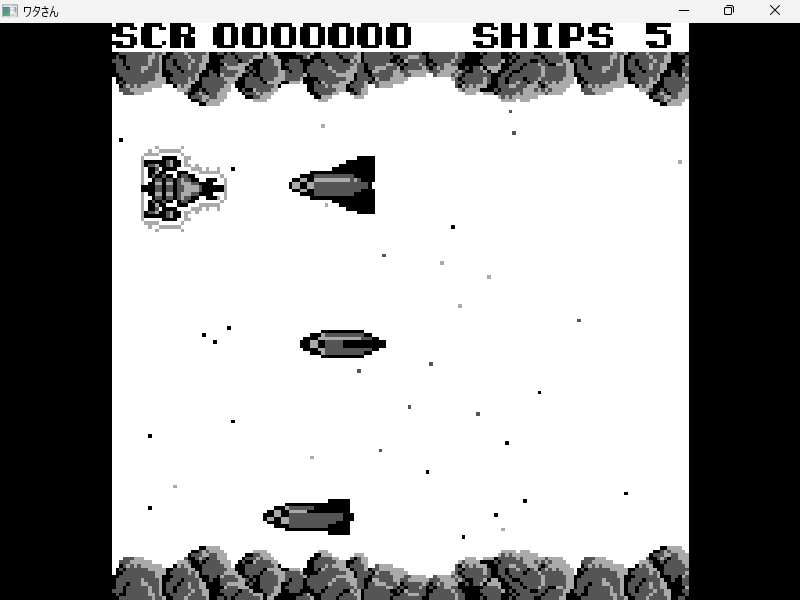
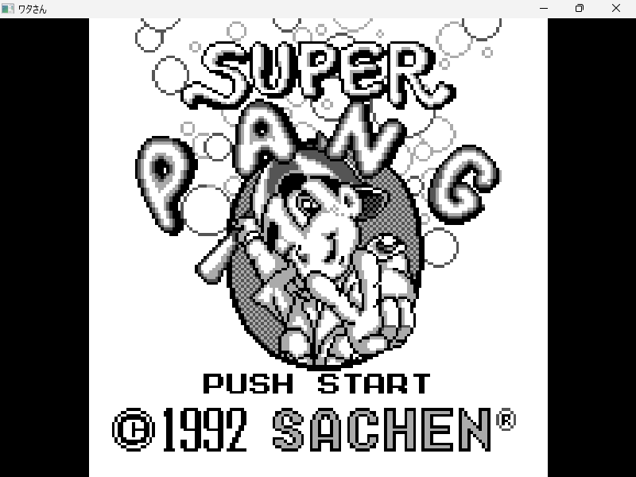
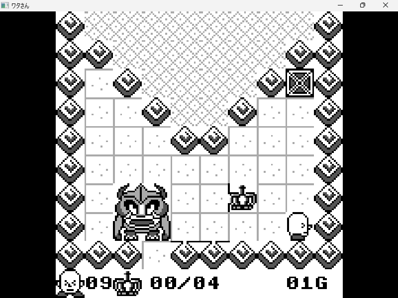
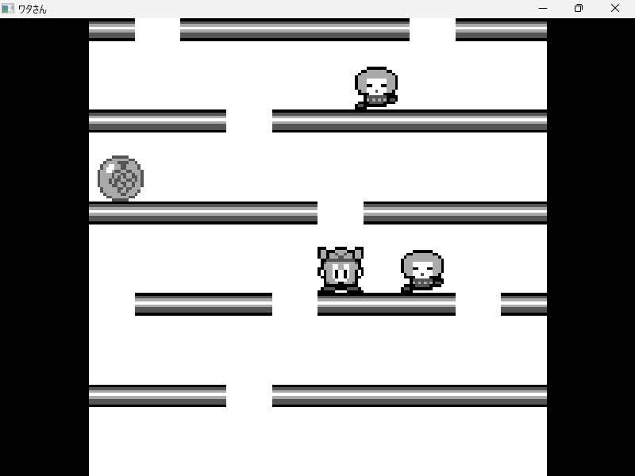
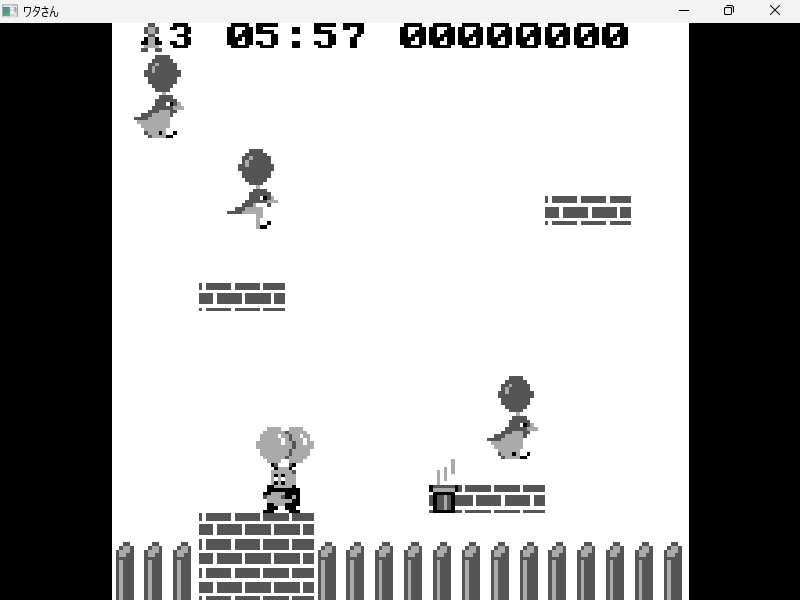
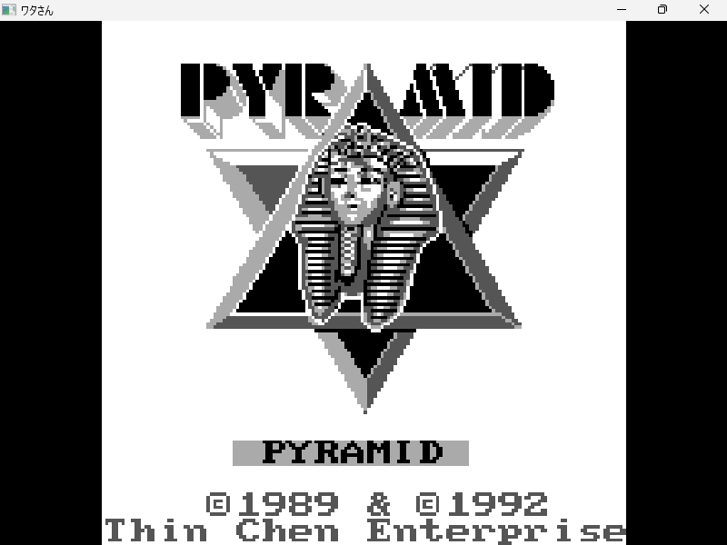
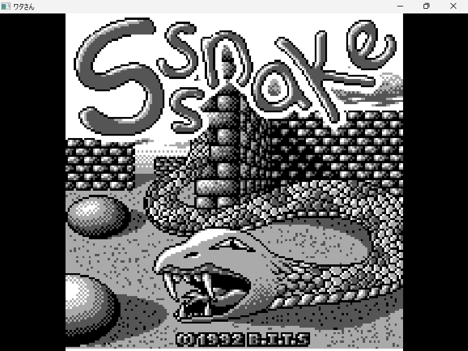

# ワタさん (WataSan)

WataSan is a simple emulator for Watara Supervision. Even if it is not pretty accurate, it can run all the games (excluding the one that requires the **MAGNUM** mapper)

## Usage

Drag and drop the rom file into ```watasan.exe```.
Alternatively, you can execute it from command line:
```watasan.exe <rom path>```

## Keyboard Input

| PC  | Super Vision |
| ------------ | --- |
| ARROW KEYS |  DPAD        |
| RIGHT SHIFT  |  SELECT |
| ENTER | START | 
| Z  | BUTTON B |
| X  | BUTTON A |
| F3 | WAVEFORM VISUALIZER |

## TODOs

- [ ] Fix ADMA channel
- [ ] Change WDC650C02 with Synertek65C02 cpu
- [ ] Complete Memory Map (read I/O regs)
- [ ] Add Magnum mapper support

## Screenshots

|  |  |  |
| ----- | ----- | ----- |
|  |  |  |
|  |  |  |


